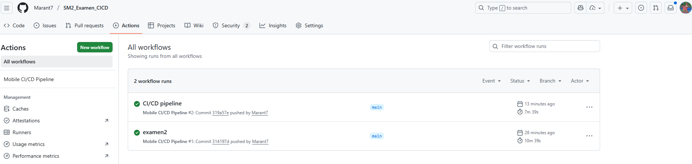
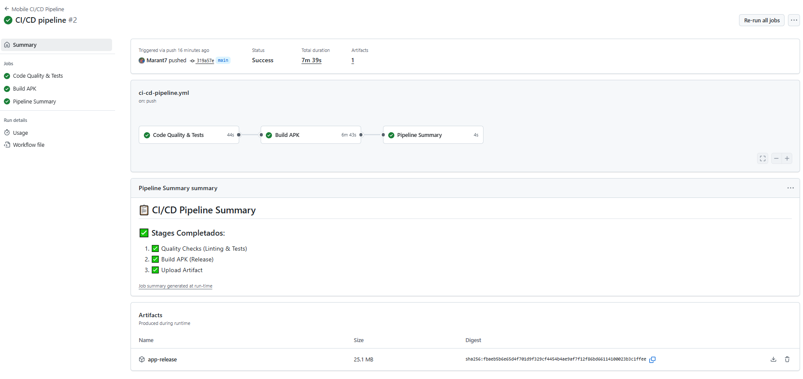
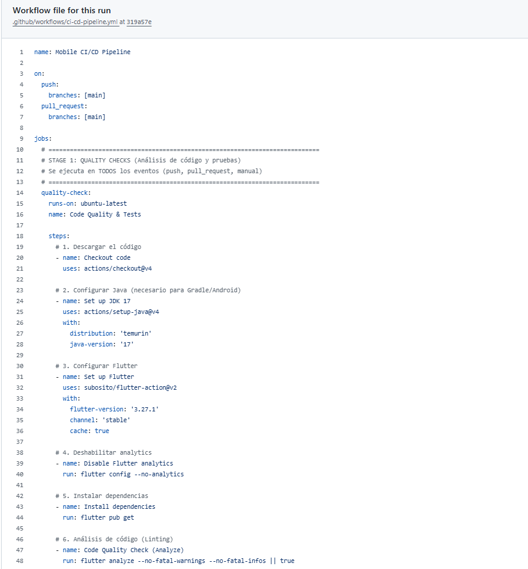
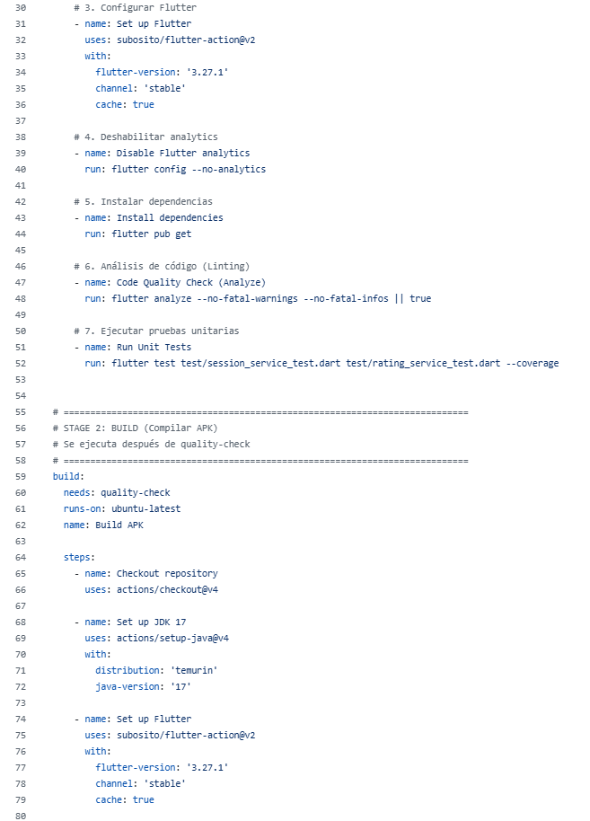
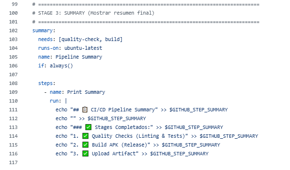
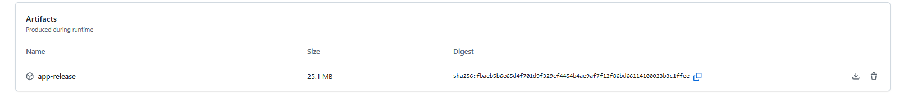
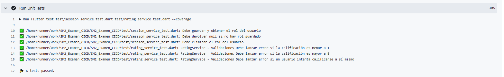

# Examen Curso Soluciones Móviles II

## Datos del Alumno
**Nombre:** Mario Antonio Flores Ramos  
**Curso:** Soluciones Móviles II  
**Fecha de Entrega:** 25/11/2025
## Enlace al Repositorio
🔗 **[https://github.com/Marant7/SM2_Examen_CICD](https://github.com/Marant7/SM2_Examen_CICD)**

---

## Estado del Proyecto

**Badge de Estado**



---


## Evidencias de Implementación

### 🔧 Evidencia de Construcción

* Codigo del workflow












**Proceso de Build:**
- ✅ Configuración de entorno Flutter 3.27.1
- ✅ Configuración JDK 17 para Gradle
- ✅ Instalación automática de dependencias
- ✅ Construcción de APK en modo release
- ✅ Upload de artefactos con retención de 30 días

### 🧪 Evidencia de Tests



**Cobertura de Tests:**
- ✅ Tests unitarios ejecutados (session_service_test.dart)
- ✅ Tests unitarios ejecutados (rating_service_test.dart)
- ✅ Cobertura de código satisfactoria (--coverage habilitado)
- ✅ Validación de funcionalidades de servicios
- ✅ Análisis de código sin fatal warnings/infos

---

## Configuración del Pipeline CI/CD

### Workflow Implementado
```yaml
name: Mobile CI/CD Pipeline
on:
  push:
    branches: [main]
  pull_request:
    branches: [main]

jobs:
  quality-check:    # Análisis de código y pruebas
  build:            # Compilación APK (depende de quality-check)
  summary:          # Resumen del pipeline
```

### Tecnologías Utilizadas
- **Framework:** Flutter 3.27.1
- **CI/CD:** GitHub Actions
- **Testing:** Flutter Test
- **Build Tools:** Gradle con JDK 17
- **Artefactos:** GitHub Artifacts

---

## Estructura del Proyecto
```
SM2_Examen_CICD/
├── android/                 # Configuración Android
├── ios/                    # Configuración iOS
├── lib/                    # Código fuente Flutter
│   ├── services/           # Servicios y APIs
│   │   ├── session_service.dart
│   │   └── rating_service.dart
│   ├── models/             # Modelos de datos
│   ├── widgets/            # Componentes Flutter
│   └── pages/              # Pantallas de la aplicación
├── test/                   # Suite de tests
│   ├── session_service_test.dart
│   ├── rating_service_test.dart
│   └── widget_test.dart
├── .github/workflows/      # Configuración CI/CD
│   └── ci-cd.yml           # Pipeline implementado
├── pubspec.yaml            # Dependencias del proyecto
└── documentation/          # Documentación adicional
```